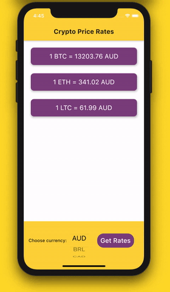

# CryptoTracker

A simple app that gives the exchange rate of Bitcoin, Ethereum and Litecoin in the desired currency. The app is made with [Flutter Framework](https://flutter.dev/).

## Screenshot

## About

A simple app that I did start to get familiar with Flutter Framework and how it pull data from an API (using the [http package](https://pub.dev/packages/http). I learnt also how to show different component depending the used system (iOS Picker for iOS devices and Dropdown menu for Android devices). The data is coming from [coinAPI.io](https://www.coinapi.io/).

## Technologies

* Flutter Framework
* http pub package.
* Platform of dart:io Package.

## Note

The app was made in few hours within a day. Very simple app.
The Button 'Get Rates' has been added due to a bug coming from the CupertinoPicker which send multiple request to the API and causes the reach of daily limit.
